# Zestimate Agent

Production-grade tool that, given any US property address, returns the **current Zillow Zestimate** — the exact value Zillow displays on its website. Target accuracy: ≥99% exact match.

## Architecture



```
                     ┌──────────────────────────────────────────────────────────┐
                     │  Docker Compose                                          │
                     │                                                          │
  Browser ──────────▶│  ui (nginx :8080)                                       │
                     │    ├─ serves React SPA (static bundle)                  │
                     │    └─ /api/* ──────────────────────────────────────────▶│
                     │                                                          │
                     │  api (FastAPI :8000)                                     │
                     │    ├─ POST /lookup          full address lookup          │
                     │    ├─ POST /lookup/stream   SSE streaming progress       │
                     │    ├─ POST /lookup/zpid     direct zpid shortcut         │
                     │    └─ DELETE /cache         clear SQLite cache           │
                     │          │                                               │
                     │          ▼                                               │
                     │   LangGraph Agent                                        │
                     │    normalize → resolve → fetch → validate                │
                     │         │           │        │                           │
                     │         ▼           ▼        ▼                           │
                     │    Nominatim    DirectProvider  ────────────────────────▶│ zillow.com
                     │    (geocode)   (curl_cffi HTML)                          │
                     │                  + RapidAPI fallback ──────────────────▶│ RapidAPI
                     │          │                                               │
                     │          ▼                                               │
                     │    SQLite cache (TTL: 1 h)                               │
                     └──────────────────────────────────────────────────────────┘
```

### Pipeline stages

| # | Stage | Input → Output | Notes |
|---|-------|---------------|-------|
| 1 | **Normalize** | raw string → `NormalizedAddress` | Nominatim geocoding; splits number/street/unit/city/state/zip |
| 2 | **Resolve** | `NormalizedAddress` → zpid | Provider search + rapidfuzz street-name match; unit-aware |
| 3 | **Fetch** | zpid → `PropertyDetail` | `DirectProvider` reads `__NEXT_DATA__` from zillow.com; RapidAPI is fallback on retry ≥ 2 |
| 4 | **Validate** | `PropertyDetail` → `ZestimateResult` | Cross-checks number/zip/state/street; range-checks zestimate |

The LLM (Mistral) is invoked only when Stage 2 returns multiple equally-plausible candidates — the happy path never calls it.

## Folder structure

```
zestimate_agent/
├── backend/                 Python / FastAPI service
│   ├── src/zestimate_agent/ package source
│   ├── tests/               pytest suite (150 unit tests)
│   ├── evals/               accuracy eval harness (20 seed addresses)
│   ├── Dockerfile
│   ├── pyproject.toml
│   └── .env.example
│
├── frontend/                React / Vite UI
│   ├── src/
│   │   ├── components/      SearchForm, StreamProgress, ResultCard, …
│   │   ├── api.ts           fetch + SSE client
│   │   └── App.tsx          state machine (idle → streaming → done)
│   ├── nginx.conf           SPA + /api proxy config
│   ├── Dockerfile
│   └── package.json
│
├── docker-compose.yml       builds + runs both services
└── .gitignore
```

## Quick start (Docker)

```bash
# 1. Copy and fill in required keys
cp backend/.env.example backend/.env
# edit backend/.env → MISTRAL_API_KEY, RAPIDAPI_KEY

# 2. Build and run
docker compose up --build
```

| Service | URL |
|---------|-----|
| UI | http://localhost:8080 |
| API | http://localhost:8000 |
| API docs | http://localhost:8000/docs |

## Local development

See [backend/README.md](backend/README.md) and [frontend/README.md](frontend/README.md) for per-service setup.

```bash
# Terminal 1 — backend
cd backend
uv sync --extra dev
uv run uvicorn zestimate_agent.api:app --reload

# Terminal 2 — frontend
cd frontend
npm install
npm run dev          # http://localhost:5173 (Vite proxies /api → :8000)
```

## Key design decisions

**DirectProvider is primary, RapidAPI is fallback.** DirectProvider reads the same `__NEXT_DATA__` blob the browser parses, so `property.zestimate` is byte-for-byte the value Zillow displays. RapidAPI wrappers cache data and can lag. DirectProvider is used on attempts 0–1; RapidAPI kicks in on attempt 2+ when DirectProvider is blocked.

**LLM only for disambiguation.** The four pipeline stages are deterministic. Mistral is invoked only when Stage 2 finds multiple HIGH-confidence address matches — roughly 1–2% of lookups.

**1-hour cache TTL.** Zestimates change infrequently but the spec requires "current" values. Cached results are re-fetched after 1 hour. Failures are cached for 6 hours to avoid hammering providers on bad addresses.
